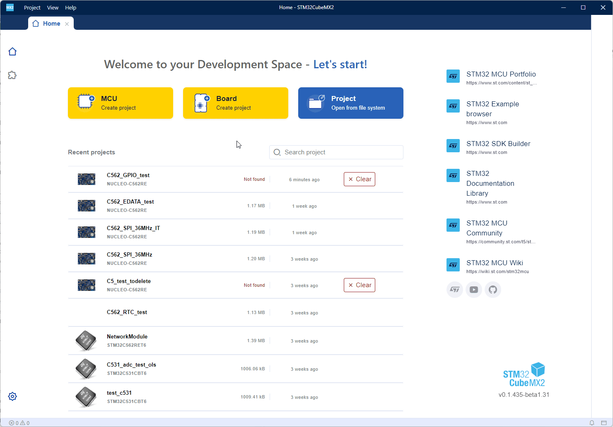
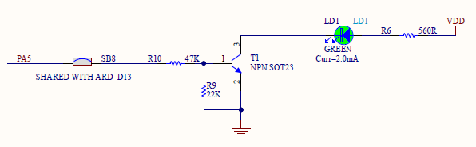
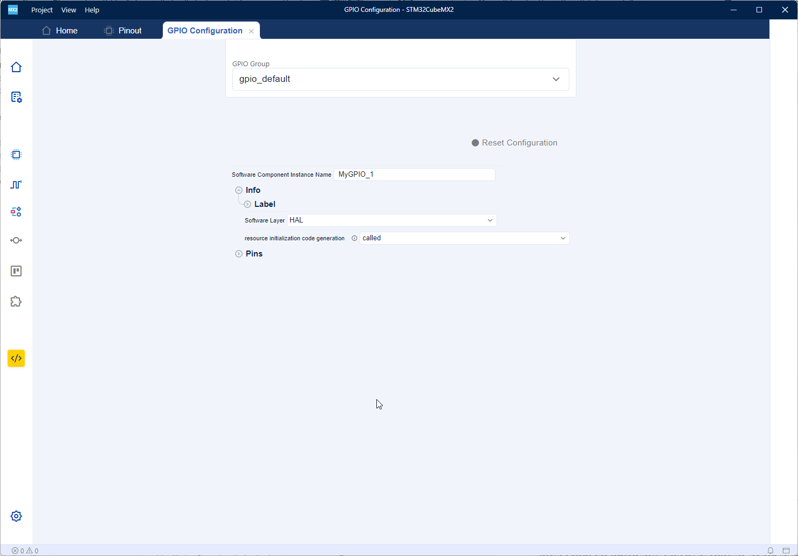
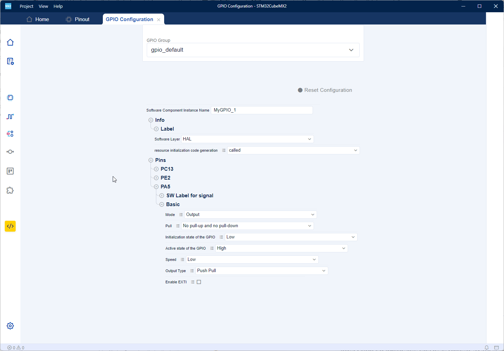
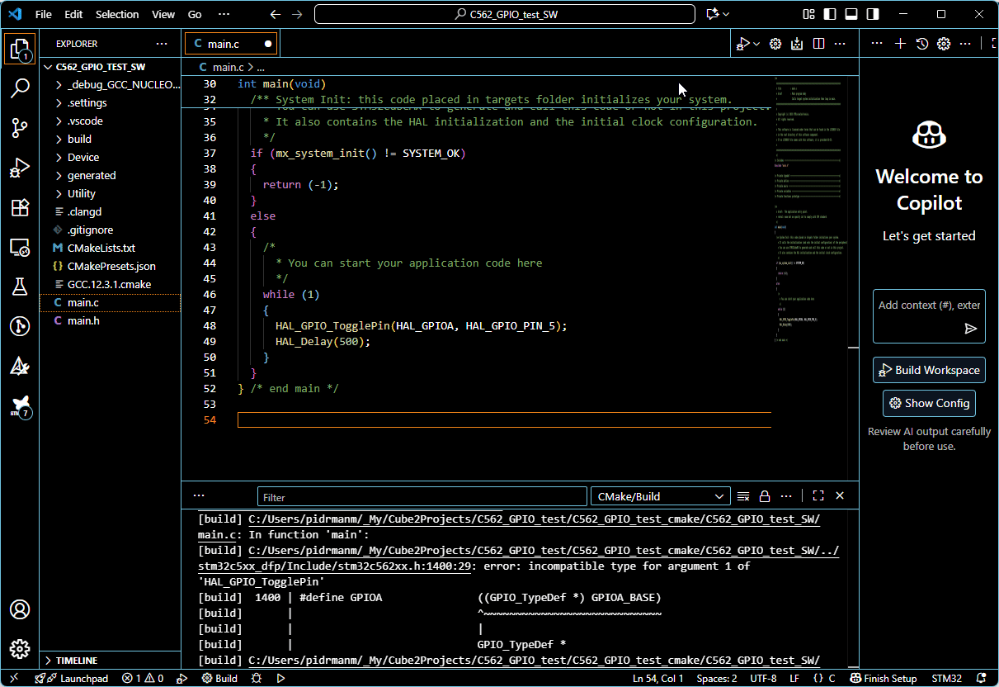
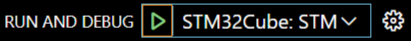
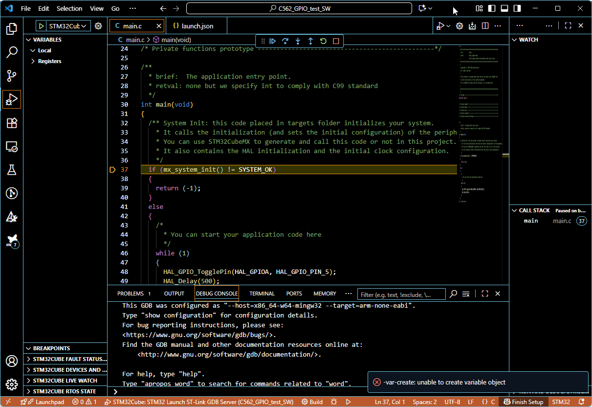

# GPIO example
In this example you will learn:
- how to create a project
- configure a pin driving the LED on the Nucleo-C562RE board 
- blink with the LED on the board.
- run debug session

Prerequisites:
- Nucleo-C562RE board
- USB-C cable
- SW: STM32 CubeMX2
- SW: VSCode with "STM32Cube for Visual Studio Code" extension

## Create a new project


Folow these steps:
1. Open **STM32 CubeMX2** application. 
> 
2. Click on the yellow button **Board Create project**
3. Type "C562" in the board search box (**Commercial part No.**), select **Nucleo-C562RE** and click **Continue**.
4. Type some **Project Name** and put the same name as **Project location** root folder.
5. Click the blue button **Automatically Download, Install & Create Project**.
6. Wait until the project creation is done.
## Configure a pin
The LED LD1 is connected to PA5 pin through a transistor T1. High level on PA5 turns the LED on.


We need to configure PA5 pin to be a GPIO output.


Folow these steps:
1. Right click on the PA5 pin in the pinout view.
2. Select **Assign signal** and check the **GPIO** mode.
3. Click the **gear icon** next to GPIO mode selection (on the right).



Folow these steps:
1. Expand node **Pins** -> **PA5** -> **Basic**.
2. Change **Mode** option from **Input** to **Output**.

## Generate a project



Follow these steps:
1. On the **action bar** (icons on left side of the window) click on **Project Manager**.
2. In the **IDE project generation** select **CMake** format.
3. Click the **Generate** button and wait until the project generation is done.

## Open project in the VSCode

There is no dedicated project file in case of CMake project for VSCode with "STM32Cube for Visual Studio Code" extension. Instead the VSCode opens **folder** containing CMake configuration files which are automatically detected by VSCode.


Follow these steps:
1. Open VSCode and go to **File** -> **Open Folder...**
2. In **Open Folder dialog** box navigate to your project location where the CMake project is based (this is the _SW folder): e.g. ../C562_GPIO_test/C562_GPIO_test_cmake/C562_GPIO_test_SW/ and open that folder by clicking **Select Folder** button.
3. After opening selected folder a "Select a configure preset for ..." option automatically appears. Here select "debug_GCC_NUCLEO-C562RE".
4. Wait until VSCode explores and load the project - some information boxes appear in the bottom right corner - here wait for message "Would you like to configure discovered CMake project(s) as STM32Cube project(s)?" and click **Yes** button.
5. A tab "Project setup (...)" will appear. Here select **NUCLEO-C562RE** in **Board/Device** selection and confirm by clicking on **Save and close** button. 
6. After this wait until the last configuration is done and the project is loaded.

## Add the code for LED blinking

We add only two lines of code to make the LED LD1 blink with 1 second period.

Follow these steps:
1. In the **action bar** on the left side select first icon **Explorer**.
2. Open **main.c** file by double clicking it.
3. Find the empty **while loop** and add these two lines in the loop to look like this:
```cpp
    while (1) 
    {
      HAL_GPIO_TogglePin(HAL_GPIOA, HAL_GPIO_PIN_5);
      HAL_Delay(500); 
    }
```

## Configure and start debug session



Follow these steps:
1. In the **action bar** on the left side select icon **Run and Debug** (Ctrl + Shift + D).
2. In **Run and Debug** window under **RUN** section click "create a launch.json file" and select "STM32Cube: STLink GDB Server" as debugger.
3. [Recommended step]: In the launch.json file add new item in the **configurations** list (this setting will automatically **save** changed files and **launch build** before debug session is started):
```json
"preLaunchTask": "CMake: build"
```
4. Save the launch.json file and click green play button 
5. Wait until debug session is ready and execution is halted at first line of code in the main.c.

## Run application



Follow these steps:
1. Hit the blue **play/pause button** on the small **debug bar** to run the application. You should observe blinking LED LD1 on the Nucleo board.
2. [Optional step]: Put the **breakpoint** on some line in the while(1) loop. Application will hit that **breakpoint**. **Run** or **Step** the application using **debug bar**.
3. Terminate the debug session by clicking orange square **Stop button** on **debug bar**. 

[<< back to main menu](../README.md)