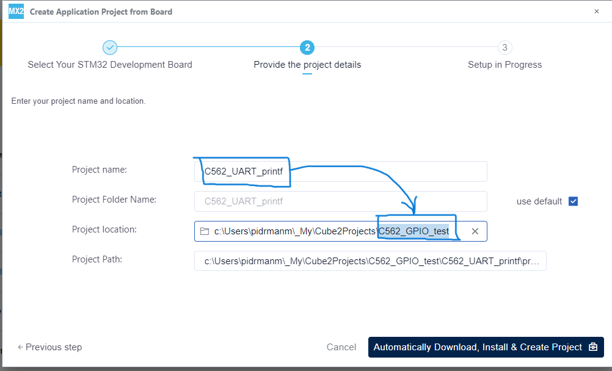
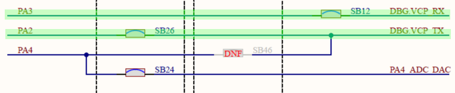
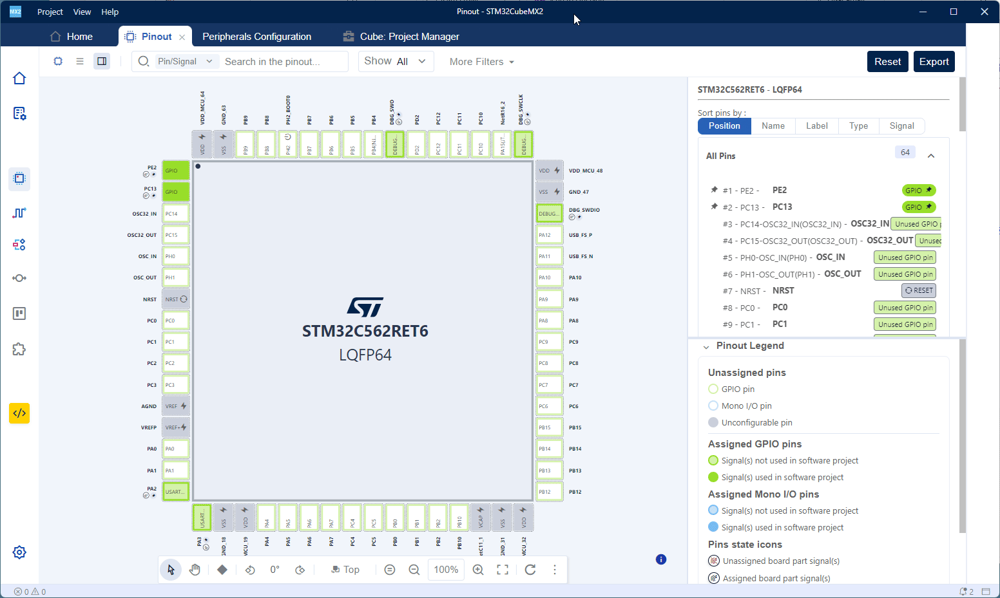
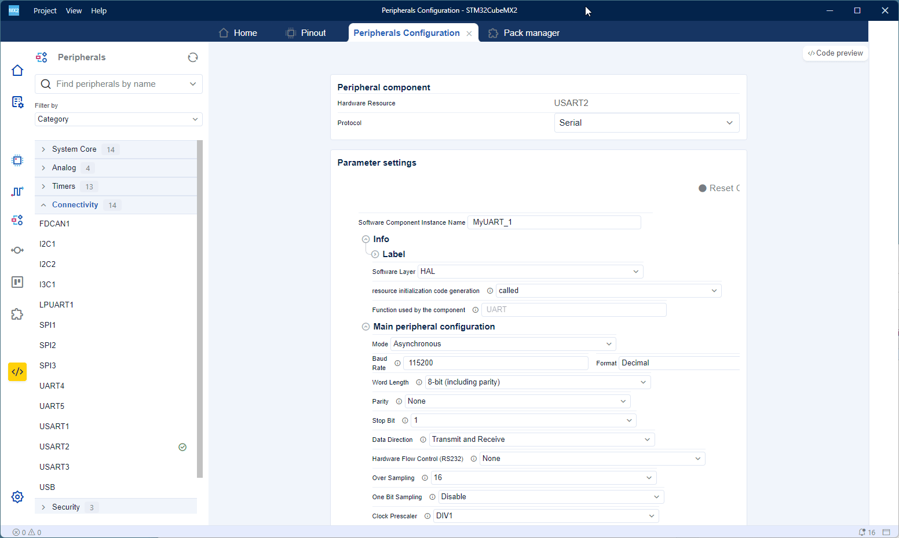
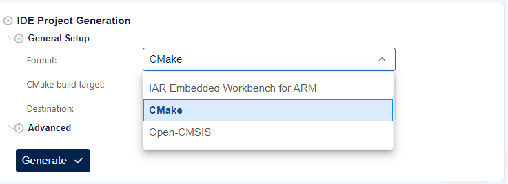
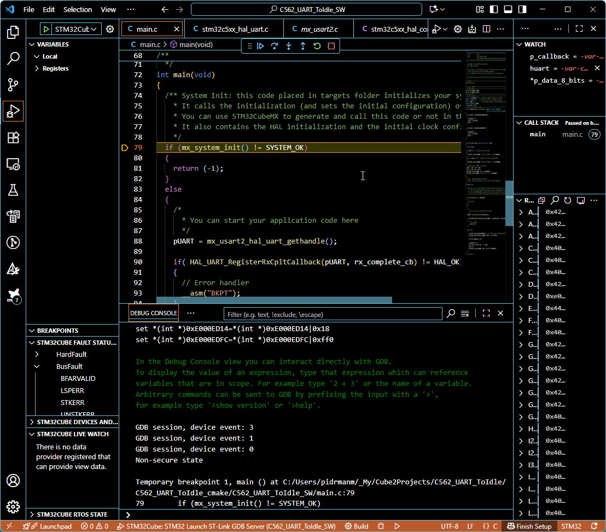

# UART Idle event reception example 
In this example you will learn:
- how to configure USART peripheral with interrupts
- how to use Idle event for reception of data with uknown size
- how to register reception complete call back function

Prerequisites:
- Nucleo-C562RE board
- USB-C cable
- SW: STM32 CubeMX2
- SW: VSCode with "STM32Cube for Visual Studio Code" extension
- SW: VSCode with "CDT Serial monitor" extension
- know how to create a project in MX2 (see GPIO example)
- know how to run debug session (see GPIO example)
- know how to set up Serial monitor in VSCode (see UART printf example)

## Create a new project

See the [GPIO example - create a new project](../C562_GPIO_test/readme.md#create-a-new-project)

Just a reminder to put a the same name of the project in the root folder name (**Project location**).



## Configure USART peripheral

Configuration in MX2 is simple, because default pin mapping of the TX and RX USART2 lines corresponds with PCB layout.

```
    PA2   --------->  USART2_TX
    PA3   --------->  USART2_RX
```





Folow these steps:
1. Click on **Peripherals** icon in the **left action bar**.
2. Find **USART2** peripheral and open USART2 **configuration tab**.
3. In this tab enable **Serial** in the protocol **option**.

This time, one more setting is needed - Enable Interrupts for USART2:



This is the default setting which is used:

```
    baud rate        = 115200 bd 
    word length      = 8 bits
    parity           = None
    nb. of stop bits = 1
```

## Generate a project

See the [GPIO example - generate a project](../C562_GPIO_test/readme.md#generate-a-project)

Just a reminder to select CMake project. See the GPIO example.



## Open project in the VSCode

See the [GPIO example - Open project in the VSCode](../C562_GPIO_test/readme.md#open-project-in-the-vscode)

## Add the code

1. In stm32c5xx_hal_conf.h enable **USE_HAL_UART_REGISTER_CALLBACKS** (set to **1**).
```
..\C562_UART_ToIdle\C562_UART_ToIdle_cmake\C562_UART_ToIdle_SW\generated\hal\stm32c5xx_hal_conf.h
```
```cpp
/* ########################## HAL_UART Config ################################### */
#define USE_HAL_UART_MODULE                     1U
#define USE_HAL_UART_CLK_ENABLE_MODEL           HAL_CLK_ENABLE_NO
#define USE_HAL_UART_REGISTER_CALLBACKS         1U // <--- here
#define USE_HAL_UART_USER_DATA                  0U
#define USE_HAL_UART_GET_LAST_ERRORS            0U
#define USE_HAL_UART_DMA                        0U
```
2. Add **maximum** TX timeout define. Only TX timeout is relevant.
```cpp
/* Private define ------------------------------------------------------------*/
#define TX_TIMEOUT 1000U
```
3. Add some **variables** and **buffer** holding characters.
```cpp
/* Private variables ---------------------------------------------------------*/
uint8_t  rx_complete = 0; // indicates complete reception on RX line
uint32_t rx_cnt = 0;      // holds the count of received characters
uint8_t flag = 0;         // to distinguish between "Trasfer complete" and "Idle" event.
hal_uart_handle_t *pUART;
char buff[100] = {0};
```
5. Add a **call back** function handling reception event.
```cpp
/* Private functions prototype -----------------------------------------------*/
void rx_complete_cb(hal_uart_handle_t *huart, uint32_t size_byte,
                                       hal_uart_rx_event_types_t rx_event)
{
  if( rx_event == HAL_UART_RX_EVENT_IDLE )
  {
    rx_complete = 1;
    rx_cnt = size_byte;  
    flag = 1;  
  }  

  if(rx_event == HAL_UART_RX_EVENT_TC)
  {
    rx_complete = 1;
    rx_cnt = size_byte;  
    flag = 2;
  }
}
```
6. Add some helper function to print out the type of reception and the number of received characters.
```cpp
void print_char_count(uint8_t _nb, uint8_t _flag)
{
  uint8_t nb[2];

  if(_flag == 1) // reception upon Idle event
  {
    HAL_UART_Transmit(pUART, (uint8_t *)"IDLE ", 5, TX_TIMEOUT);
  }
  else if (_flag == 2) // reception upon Count reached event
  {
    HAL_UART_Transmit(pUART, (uint8_t *)"COUNT ", 6, TX_TIMEOUT);
  }
  // Converts dec. number to characters
  nb[0] = (_nb / 10) + 0x30;
  nb[1] = (_nb % 10) + 0x30;
  HAL_UART_Transmit(pUART, nb, 2, TX_TIMEOUT);
  HAL_UART_Transmit(pUART, (uint8_t *)": ", 2, TX_TIMEOUT);
}
```
7. In the **user application code** we will retrieve **UART handle**, register **UART callback function** and set up a **while loop** receiving data from terminal through UART with uknonw size and echo that data back with information about reception event type and number of received characters.
```cpp
    /*
      * You can start your application code here
      */
    pUART = mx_usart2_hal_uart_gethandle();

    if( HAL_UART_RegisterRxCpltCallback(pUART, rx_complete_cb) != HAL_OK)
    {
      // Error handler
      __asm("BKPT");      
    }

    while (1) 
    {
      LL_USART_ClearFlag_ORE(USART2); // To recover after exceeding buffer count during reception
      HAL_UART_ReceiveToIdle_IT(pUART, buff, sizeof(buff));

      while(rx_complete == 0);
      
      rx_complete = 0;
      print_char_count(rx_cnt - 1, flag);
      flag = 0;
      HAL_UART_Transmit(pUART, buff, rx_cnt, TX_TIMEOUT);
    }
```

## Configure and start debug session

See the [GPIO example - configure and start debug session](../C562_GPIO_test/readme.md#configure-and-start-debug-session)

## Run application

You can disable showing sent data in the Serial monitor (circle icon). But when exploring behavior with exceeding max number of received characters, it is handful to see what was sent.

> Note that Serial monitor is sending LF ('\n' - new line) character after each transmission. This is count as valid character in UART reception but the value shown in the log is by one less to show number of only visible characters (including space).



Follow these steps:
1. Hit the blue **play/pause button** on the small **debug bar** to run the application.
2. If you can't see **Serial Monitor** in the **Panel** among the other views (Problems, Output, Debug Console,...) click the three dots "**...**" to open hidden views.
3. Click on **Serial Monitor** to open this view.
4. Select correct COM port in **Port** selection drop down box. Seek for "**STMicroelectronics STlink Virtual COM Port**".
5. The default settings is in line with our setting of UART (115200 8N1).
6. Check if the **Line ending** option is set to **LF**.
7. Click on **Start Monitoring** button.
 
8. Now type **some text** in the serial monitor **input line** and press **Enter**. MCU sends back an **echo** of the string sent to the board. 

> Any **white space** will terminate the string (space, LF, CR, tab,...), so, don't be confused if you put some **white space**, send the string and observe **corrupted echo**.

[<< back to main menu](../README.md)