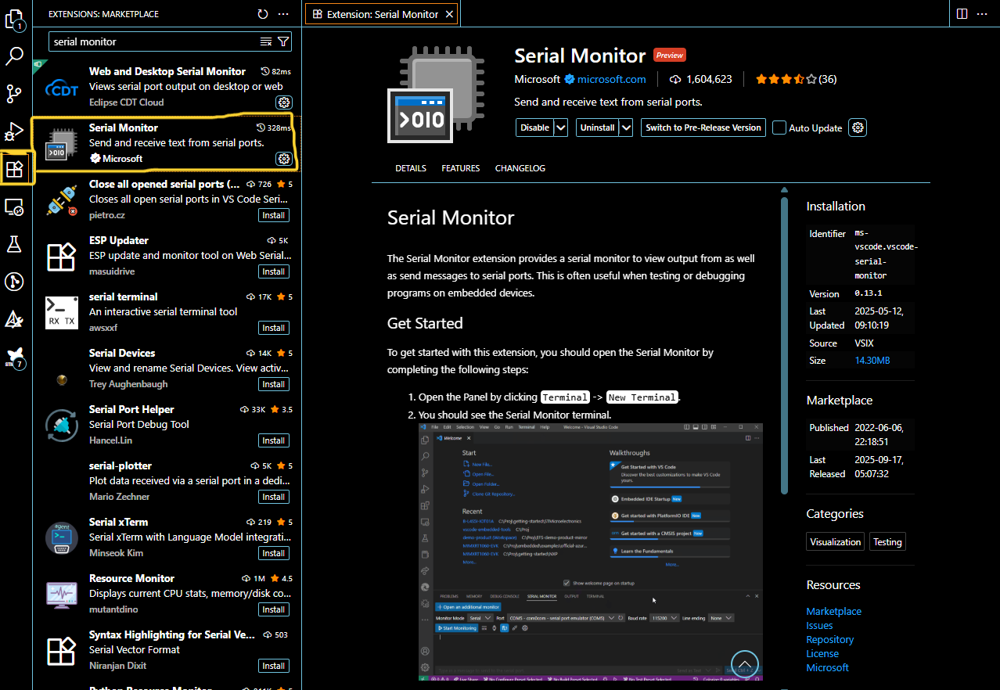
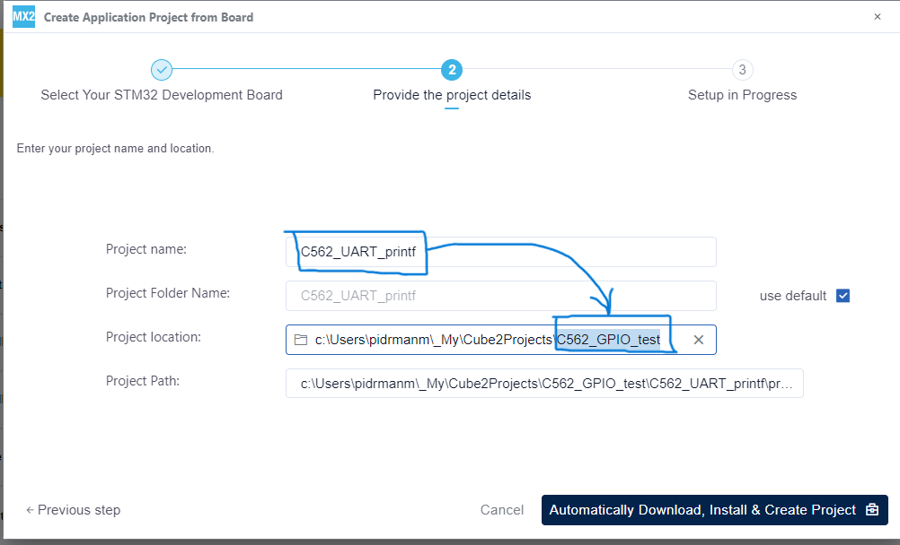
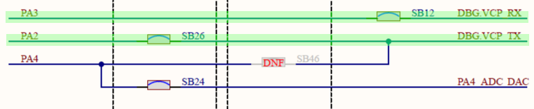
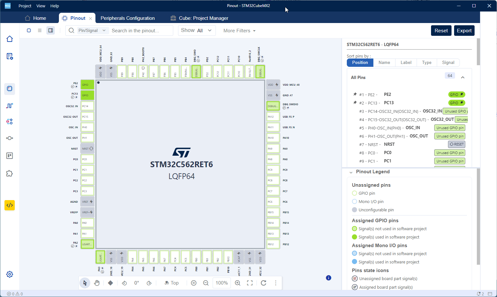
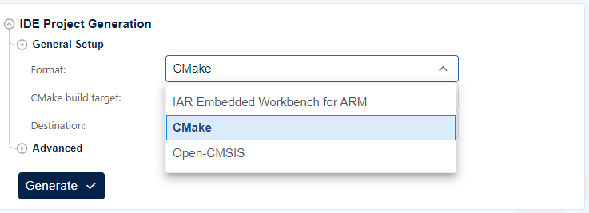

# UART printf example
In this example you will learn:
- how to configure USART peripheral in the MX2
- how to redirect standard library printf() and scanf() function to UART
- how to test serial communication using VSCode Serial monitor

Prerequisites:
- Nucleo-C562RE board
- USB-C cable
- SW: STM32 CubeMX2
- SW: VSCode with "STM32Cube for Visual Studio Code" extension
- SW: VSCode with "CDT Serial monitor" extension
- know how to create a project in MX2 (see GPIO example)
- know how to run debug session (see GPIO example)

To install "**CDT Serial monitor**" extension, simply find that extension in the **Extensions Marketplace** side bar and install it.



## Create a new project

Just a reminder to put a the same name of the project in the root folder name (**Project location**).



## Configure USART peripheral

Configuration in MX2 is simple, because default pin mapping of the TX and RX USART2 lines corresponds with PCB layout.

```
    PA2   --------->  USART2_TX
    PA3   --------->  USART2_RX
```





Folow these steps:
1. Click on **Peripherals** icon in the **left action bar**.
2. Find **USART2** peripheral and open USART2 **configuration tab**.
3. In this tab enable **Serial** in the protocol **option**.

Note: No other settings is needed, the default setting is 115200 8N1 (we will use this setting later):

```
    baud rate        = 115200 bd 
    word length      = 8 bits
    parity           = None
    nb. of stop bits = 1
```

## Generate a project

Just a reminder to select CMake project. See the GPIO example.



## Open project in the VSCode

See the GPIO example.

## Add the code to redirect printf()

There are two function prototypes which are used by standard library **stdio**. You can find them in **syscalls.c**
```
\C562_UART_printf\C562_UART_printf_cmake\C562_UART_printf_SW\Utility\syscalls.c
```
```cpp
extern int __io_putchar(int ch) __attribute__((weak));
extern int __io_getchar(void) __attribute__((weak));
```
These *weak* functions needs to be overriden by our code to use UART as interface for sending and receiving data.

1. First of all, include **stdio.h** header in the **main.c**.

```cpp
/* Includes ------------------------------------------------------------------*/
#include "main.h"
#include <stdio.h>
```

2. Add these functions implementation in the **main.c**

```cpp
int __io_putchar(int ch)
{
  if (HAL_UART_Transmit(pUART, (uint8_t *)&ch, 1U, TX_TIMEOUT) == HAL_OK)
  {
    return ch;
  }
  else
  {
    return EOF;
  }
} 

int __io_getchar(void) 
{
  uint8_t ch = 0;

  LL_USART_ClearFlag_ORE(USART2);

  if (HAL_UART_Receive(pUART, &ch, 1U, RX_TIMEOUT) != HAL_OK)
  {
    return EOF;
  }

  return (int8_t)ch;
}
```
3. Add these defines used in the functions above in the **main.c**

```cpp
/* Private define ------------------------------------------------------------*/
#define RX_TIMEOUT 10000U
#define TX_TIMEOUT 1000U
```
4. Add the UART HAL handler which is used in the functions above in the **main.c**

```cpp
/* Private variables ---------------------------------------------------------*/
hal_uart_handle_t *pUART;
```
5. Add initialization of UART HAL handler at the beginning of the **main.c**

```cpp
int main(void)
{
  pUART = mx_usart2_hal_uart_gethandle();

...
}
```

5.  In the **main.c** add these lines in the **while(1)** loop to receive some string over UART using **scanf()** and send back an echo string using **printf()**. Note the "**\n**" (new line or line feed) character at the end of the echo string.

```cpp
    /*
      * You can start your application code here
      */
    char buff[100];
    setvbuf(stdin, NULL, _IONBF, 0); //TO HANDLE INPUT BUFFER WHEN USING SCANF/COUT
    while (1) 
    {
      scanf("%s",buff);
      printf("Echo: %s\n", buff);
    }
```

6. Using a **scanf()** function is more demanding regarding the **stack size** needs. Enlarge **stack size** in the **.ld** file (original value is 1kB, new is 4kB). Be careful and use correct linker file, which is located in DFP templates:
> ..\C562_UART_printf\C562_UART_printf_cmake\stm32c5xx_dfp\Source\Templates\gcc\linker\stm32c562xe_flash.ld

```cpp
heap_SIZE = 0x200;
stack_SIZE = 0x1000;
```

## Configure and start debug session

See the GPIO example.

## Run application

Before starting application, let's start monitor on serial port.


Follow these steps:
1. If you can't see **Serial Monitor** in the **Panel** among the other views (Problems, Output, Debug Console,...) click the three dots "**...**" to open hidden views.
2. Click on **Serial Monitor** to open this view.
3. Select correct COM port in **Port** selection drop down box. Seek for "**STMicroelectronics STlink Virtual COM Port**".
4. The default settings is in line with our setting of UART (115200 8N1). If not opened, open the detailed settings by clicking on gear icon.
5. Check if the **Line ending** option is set to **LF**.
6. Click on **Start Monitoring** button.
7. Hit the blue **play/pause button** on the small **debug bar** to run the application. 
8. Now type **some text** in the serial monitor **input line** and press **Enter**. MCU sends back an **echo** of the string sent to the board. 

> Any **white space** will terminate the string (space, LF, CR, tab,...), so, don't be confused if you put some **white space**, send the string and observe **corrupted echo**.